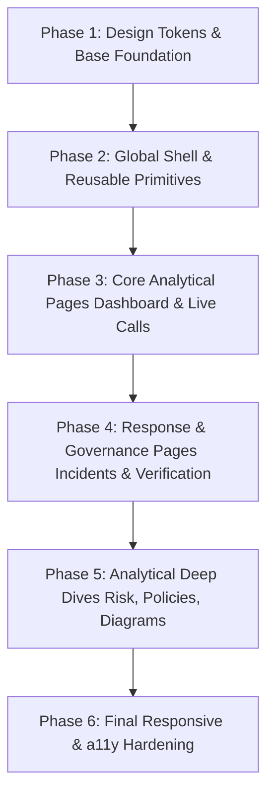

# VOXSHIELD — Phased UI/UX Redesign Plan

**Document Version:** 1.0.0  
**Phase:** Phase 1 — UI/UX Audit & Design Foundation  
**System Scope:** VOXSHIELD Security Operations Center (Frontend)  
**Execution Constraint:** Preserve 100% of working AI pipelines, WebSocket protocols, audio streamers, and backend contracts. Zero regression on verified functionality.

---

## 1. Strategy & Guiding Principles

1. **Non-Breaking Visual Modernization**:
   All UI enhancements must be strictly cosmetic, layout-improving, and token-unifying. No changes may be made to API request formats, WebSocket message structures, or audio buffering parameters.
2. **Design Token Centralization**:
   Replace scattered inline styles and arbitrary Tailwind values with the official VOXSHIELD Sentinel Design System (VSDS) tokens.
3. **Phased, Incremental Deployment**:
   Refactor atomic UI components first, followed by structural layout shells (Sidebar/Navbar), and finally page-by-page screen polishing.

---

## 2. Redesign Implementation Roadmap

---

### Step 1: Design Tokens & Utility Synchronization
- **Scope**: `globals.css` and `tailwind.config.js`.
- **Action Items**:
  1. Synchronize all color channels, ensuring light and dark themes have identical semantic contrast ratios.
  2. Define standardized typography utility classes: `.text-title`, `.text-card-header`, `.text-body`, `.text-subtext`, `.text-mono-data`.
  3. Define standardized button classes: `.btn-primary`, `.btn-secondary`, `.btn-danger`, `.btn-subtle`.
  4. Standardize input classes: `.input-enterprise`.
- **Verification**: Zero build errors on `npm run build`.

---

### Step 2: Global Shell & Core UI Primitives Refactoring
- **Scope**:
  - `components/Sidebar.tsx`
  - `components/Navbar.tsx`
  - `components/ThemeToggle.tsx`
  - `components/ui/MetricCard.tsx`
  - `components/ui/EmptyState.tsx`
  - `components/ui/LoadingState.tsx`
  - `components/ui/SecurityStatusBadge.tsx`
- **Action Items**:
  1. **Navbar**: Standardize status badge geometry; add smooth transition on analyst avatar and operational pills.
  2. **Sidebar**: Refactor mobile drawer animations; standardize hover background to `bg-surface-hover`.
  3. **Loading Primitives**: Add reusable skeleton pulse loader component (`components/ui/Skeleton.tsx`).
  4. **Badges**: Ensure all badges inherit from `SecurityStatusBadge.tsx` rather than bespoke inline span tags.

---

### Step 3: High-Impact Operations Pages
#### A. `/dashboard` (SOC Overview)
- **Action Items**:
  1. Replace full-page loading spinner with 4-card metric skeleton loaders.
  2. Unify threat list and incident table typography and badge mappings.
  3. Enhance real-time alert pulses when live WebSocket threat events arrive.

#### B. `/calls` (Live Voice Sessions)
- **Action Items**:
  1. Refine empty state illustration when no call is selected to provide a clean prompt to start a mic test.
  2. Enhance real-time audio streaming visualizer (reactive CSS pulsing bars during active speech).
  3. Ensure seamless transition between `CRITICAL` alert styling and `LOW` recovery state without layout jumping.
  4. Preserve all existing audio streamer and WebSocket sequence hooks.

---

### Step 4: Incident Response & Step-Up Verification
#### A. `/incidents` (Case Management)
- **Action Items**:
  1. Introduce sticky header and filter toolbar for seamless scrolling through deep incident lists.
  2. Refactor containment action buttons into an elevated, accessible action bar.
  3. Add clear status transition micro-animations.

#### B. `/verification` (Step-Up Auth)
- **Action Items**:
  1. Clean up target identity input options with clear executive user badges.
  2. Add visual status icons (`Approved`, `Pending`, `Expired`) to the challenge history table.
  3. Unify feedback notifications into an accessible toast banner.

---

### Step 5: Advanced Analytics & Presentation Hubs
#### A. `/risk` (10D Threat Tensor)
- **Action Items**:
  1. Standardize 10D tensor grid cards with consistent heights and metric badges.
  2. Enhance explainability cues with collapsible detail drawers.

#### B. `/policies` (Security Policy Engine)
- **Action Items**:
  1. Upgrade top pipeline ribbon with connected node icons and active stage highlights.
  2. Style the JSON simulator textarea with monospace typography and dark-mode code frame styling.

#### C. `/diagrams` (Architecture Hub)
- **Action Items**:
  1. Ensure all 3 SVG vector previews render at 16:9 aspect ratios without layout shift.
  2. Unify diagram theme controls with global application state.

#### D. `/audit` & `/health` (Governance & Health)
- **Action Items**:
  1. Enhance audit log JSON drawer with copy-to-clipboard button and monospace formatting.
  2. Standardize subsystem health card metric badges and uptime meters.

---

## 3. Risk Mitigation & Regression Prevention

| Risk Vector | Impact | Mitigation Mechanism |
| :--- | :--- | :--- |
| **Breaking Audio Streaming** | Critical | Touch zero lines inside `audio_streamer.ts` or WebSocket handlers in `calls/page.tsx`. |
| **CSS Cache Overwrite** | Medium | Do not run `next build` concurrently while `next dev` is serving live requests. |
| **Theme Bleed** | Low | Verify every component using CSS custom variables rather than hardcoded `text-white` or `bg-slate-900`. |
| **Layout Shift on Mobile** | Low | Validate all changes across standard Chrome headless viewports (1920 to 390px) before merging. |

---

## 4. Verification Checkpoints for Subsequent Phases

After each phase is implemented, run:
1. `npm run build` (Ensures zero TypeScript and lint compilation regressions).
2. `node scratch/check_frontend_css.js` (Confirms CSS bundle delivery and HTTP 200).
3. `node scratch/test_phase7_live_e2e.js` (Guarantees live mic/WebSocket threat pipeline remains unaffected).
4. Headless Chrome screenshot capture across all 6 viewports.
