# VOXSHIELD: Problem Statement

## 1. Executive Summary
The rapid proliferation of generative artificial intelligence, neural audio synthesis, and real-time voice conversion models has fundamentally compromised acoustic trust in telecommunication, VoIP, and enterprise contact center environments. Adversaries can now clone human voices with few-shot reference audio (under 3 seconds) and execute high-fidelity impersonation attacks in real time.

However, existing defensive solutions suffer from a catastrophic conceptual flaw: **they reduce the problem to binary synthetic speech detection (fake vs. real).**

## 2. Core Philosophy & Axiom
> **"A voice being genuine does not automatically make the interaction trustworthy."**

A comprehensive voice security system must recognize that:
1. **Genuine Voices Can Be Malicious**: An authentic voice can be used by an insider, an unauthorized individual with physical phone access, a compromised account holder under duress, or an employee engaging in social engineering.
2. **Synthetic Voices Can Be Incidental**: Legitimate accessibility tools, translation engines, and synthetic assistants can be used in benign scenarios.
3. **Impersonation is Multi-Modal**: High-impact voice fraud combines acoustic cloning with social engineering tactics (urgency, authority, fear, secrecy, exception handling) to extract sensitive authentication secrets (OTPs, PINs, recovery codes) or trigger high-value unauthorized actions (wire transfers, credential resets, beneficiary alterations).

## 3. The VOXSHIELD Mission
VOXSHIELD acts as a real-time, non-invasive security layer deployed beside telephony, VoIP, and contact center infrastructures. It monitors and correlates acoustic indicators, linguistic intent, speaker identity verification, social engineering markers, and requested action risks in real time.

### Target Workflow Pipeline

```mermaid
graph LR
    Call[Call / Audio Stream] --> Ingest[Listen / Ingest Real-Time]
    Ingest --> Detect[Multi-Engine Detection]
    Detect --> Understand[Semantic & Intent Analysis]
    Understand --> Correlate[Context & Identity Correlation]
    Correlate --> Risk[Unified Risk Assessment]
    Risk --> Policy[Deterministic Policy Enforcement]
    Policy --> Action[Allow / Step-Up Verify / Block]
    Action --> Privacy[Privacy Firewall & Redaction]
    Privacy --> Incident[Incident Lifecycle & Audit]
    Incident --> Feedback[Continuous Model Learning]
```

## 4. Problem Scope & Target Attack Scenarios
- **Real-Time Voice Cloning & TTS Attacks**: Deepfake neural speech impersonating C-level executives, clients, employees, or government officials.
- **Replay & Splicing Attacks**: Replaying intercepted authentic recordings or spliced phonetic segments to bypass voice biometrics.
- **Social Engineering & Coercion**: High-pressure psychological manipulation demanding urgent bypass of standard authentication protocols.
- **Sensitive Credential Extraction**: Systematic harvesting of one-time passwords (OTP), multifactor codes (MFA), CVVs, and cryptographic tokens.
- **Fraudulent Financial & Authorization Requests**: Unauthorized account takeover, fraudulent invoice modification, payroll redirect, and emergency wire approvals.
